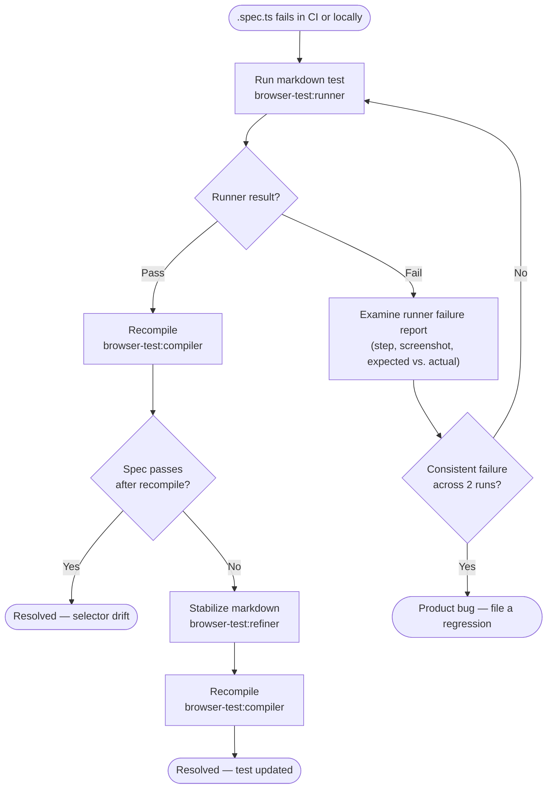

# browser-test-skills

<p align="center"></p>

A set of Claude Code skills that provides a complete E2E browser test pipeline using Playwright MCP.

## What It Does

Four skills that form a pipeline for creating, stabilizing, compiling, and running E2E browser tests:

```
Author → Refiner → Compiler → Playwright CI
```

| Skill | Purpose                                                                                                                                     |
|-------|---------------------------------------------------------------------------------------------------------------------------------------------|
| `browser-test:author` | Turns a vague feature description into a structured markdown test case via exploratory browser runs                                         |
| `browser-test:refiner` | Stabilizes a test case by running it repeatedly, fixing flaky steps, and updating conventions until N consecutive passes                    |
| `browser-test:runner` | Executes a stable test case exactly as written using Claude and playwright-mcp, reports pass/fail with evidence. Requires LLM to run tests. |
| `browser-test:compiler` | Converts a stable markdown test case into a Playwright `.spec.ts` file via guided browser replay. No LLM dependency to run tests.       |

## Installation

The skills ship as a Claude Code plugin. Install them from the marketplace defined in this repo.

### From the marketplace (recommended)

Inside a Claude Code session, add the marketplace and install the plugin:

```
/plugin marketplace add https://github.com/Autodesk/claude-browser-test-skills
/plugin install browser-test@browser-test-skills
```

`browser-test` is the plugin name; `browser-test-skills` is the marketplace name (from `.claude-plugin/marketplace.json`). After installing, the four skills are available as `browser-test:author`, `browser-test:refiner`, `browser-test:compiler`, and `browser-test:runner`.

### From a local checkout (development)

To try the skills without publishing, add the local directory as a marketplace:

```
/plugin marketplace add /path/to/claude-browser-test-skills
/plugin install browser-test@browser-test-skills
```

### Validate the plugin

Before publishing changes, validate the manifest and skill frontmatter from the repo root:

```bash
claude plugin validate .
```

## Getting Started

The fastest way to get comfortable with the skill pipeline is to try it on a public demo app before writing tests against your own product. This removes all environment friction — no credentials to set up, no conventions files to write, no dev server to run — so you can focus entirely on learning how the skills work together.

### Try it on saucedemo.com

[Saucedemo](https://www.saucedemo.com) is a purpose-built demo e-commerce site designed specifically for practising test automation. It has login, product listing, cart, and checkout flows that are realistic enough to be meaningful but simple enough to learn on. Login credentials are documented on the site's main page.

**Step 1 — Explore manually first**

Before invoking any skill, spend a few minutes on the site yourself. Log in, browse the products, add something to the cart, and complete a checkout. Pick one simple, end-to-end flow you'd like to turn into a test — for example, adding a specific item to the cart and checking out as a standard user.

Doing this yourself first means you arrive at the authoring step with a clear mental model of the expected behaviour. The author skill will produce a much sharper test case when you can describe the flow precisely rather than asking it to discover one from scratch.

**Step 2 — Author the test (directed)**

Once you've chosen a flow, describe it directly:

> "Write a test that verifies a standard user can add an item to the cart and complete checkout on <https://www.saucedemo.com>"

**Step 3 — Run the full pipeline**

```
"Refine the saucedemo checkout test"     → browser-test:refiner
"Compile the saucedemo checkout test"    → browser-test:compiler
npx playwright test                      → runs the generated .spec.ts in CI
```

After one full pass on saucedemo you'll have the muscle memory for the workflow. Then move on to your real product — set up your project structure and conventions files as described in [Project Setup](#project-setup), and start authoring tests that reflect your team's actual domain knowledge.

**Later — Exploratory authoring**

Once you're comfortable with the pipeline, the author skill can also drive discovery. Ask it to explore the site and propose a full test plan:

> "Do exploratory testing on <https://www.saucedemo.com>, discover what flows are present, and suggest a set of tests broken down by functional area."

`browser-test:author` will navigate the site, identify distinct user flows, and return a prioritised list of test scenarios grouped by area — before writing a single test case. This is more time-intensive but surfaces coverage gaps you might not have thought to look for.

---

## The Gap This Closes

The scarce, valuable knowledge in a test suite is **domain intent** — what the application is supposed to do, and which behaviours actually matter. Selector strings, `waitFor` timing, and session plumbing are just mechanics. Yet traditional automation forces that domain knowledge to be expressed in a technical language its owners don't speak, so the people who understand how the app should behave are rarely the ones who can encode it into a stable test.

The result is a suite written by whoever happened to have both the time and the Playwright expertise — covering the flows that were easiest to automate rather than the ones that matter most, and maintained by people who often can't tell whether a red test means a real regression or just drifted plumbing.

**This project closes that gap by keeping the two concerns separate.** The source of truth is a plain-language markdown test case: a domain expert describes what should happen, and the LLM handles the mechanics — finding selectors, stabilizing timing, generating runnable Playwright code. Domain knowledge stays where the humans are; the technical layer becomes a derived, disposable artifact. AI does the toil, but a person always authors the intent and owns the pass/fail judgement.

---

## How It Works (And Why It's Different)

In traditional E2E automation, an engineer reads source code or uses DevTools to find CSS selectors, then hard-codes them into a Playwright or Selenium script. It works initially, but it's brittle: a class rename or component restructure breaks the selectors even when the feature is unchanged, and keeping the suite green becomes maintenance work that competes with shipping features.

### The LLM-driven approach

These skills use an LLM paired with a playwright-mcp browser to interact with the live application the same way a human tester would: navigate to a page, observe what's on screen, click elements, fill forms, and verify outcomes. Selectors come from live accessibility snapshots taken during the session — not from reading source code. The LLM sees the same accessibility tree a screen reader would, which means selectors are grounded in what the user actually experiences rather than implementation details that can change silently.

Because the LLM observes the real browser, it also encounters the real timing behaviour, the real loading states, and the real edge cases — and documents how it handled them. That documentation becomes the test case.

### The pipeline explained

```
Author → Refiner → Compiler → Playwright CI
```

| Stage | Purpose | Why it exists |
|---|---|---|
| **Author** | Explores the live app, identifies scenarios, produces a markdown test case | Captures domain knowledge in a human-readable format without requiring automation expertise |
| **Refiner** | Runs the test repeatedly, fixes flaky steps, updates conventions | A test that passes once isn't reliable; the refiner makes it deterministic before it goes anywhere near CI |
| **Compiler** | Replays the stable markdown test in a live browser, records every selector from accessibility snapshots, produces a `.spec.ts` | Converts the LLM-dependent test into a standard Playwright file that runs in CI without an LLM |
| **Runner** | Executes the markdown test faithfully, reports pass/fail with evidence | Lets you validate the live app against the markdown source at any time, independent of the compiled spec |

The key insight: **the markdown test case is authoritative, and the `.spec.ts` is a derived artifact.** If a compiled test fails, you go back to the markdown — not the other way around.

### Self-healing through refine → compile

Because the `.spec.ts` is derived rather than hand-written, it can be regenerated. When the UI shifts and a compiled test drifts, you don't hunt through broken selectors — you **recompile**, and every selector is regenerated from a fresh accessibility snapshot of the current app. If the steps themselves have drifted, the refiner re-stabilizes the markdown first, then you recompile. The test heals against UI change automatically; the only thing a human does is confirm the domain *intent* still holds. This loop is exactly what the [When a Compiled Test Fails](#when-a-compiled-test-fails) decision tree walks through.

### Design principles

- **Browser is the source of truth** — All selectors come from live `browser_snapshot` accessibility trees, never from reading application source code. This ensures every selector is tested against a real browser session before it's written down.
- **Accessibility-tree first** — Prefer `getByRole`, `getByTestId`, `getByLabel` over CSS selectors. Accessibility attributes are stable by design; they change when the feature changes, not when the styling changes.
- **Fresh session every run** — No session bleed between test runs. Each run starts from a clean browser state, which eliminates an entire class of intermittent failures caused by leftover cookies, cached state, or prior test side-effects.
- **Conventions capture patterns** — Reusable patterns (login sequences, session management, common UI flows) live in conventions files, not in the LLM's implicit knowledge. This makes the test suite portable across sessions and models.
- **Markdown is authoritative** — Test cases are human-readable markdown that any team member can review, question, and understand. Compiled `.spec.ts` files are generated output; the markdown is what you maintain.

### Best practices, satisfied and extended

E2E testing already has a well-understood set of best practices. This pipeline doesn't replace them — it satisfies each one by construction, then uses AI to push past the point where they usually break down, without removing the human from the loop.

| Established best practice | How the pipeline satisfies it | How AI extends it — human stays in the loop |
|---|---|---|
| **Accessibility-first selectors** (roles/labels over CSS) | Every selector is captured from a live accessibility snapshot; `getByRole`/`getByLabel`/`getByTestId` are preferred over CSS | AI grounds selectors in what the user actually experiences on every run; the human never has to reverse-engineer them from source |
| **Deterministic, flake-free tests** | The refiner runs the test repeatedly and fixes flaky steps until N consecutive passes before it reaches CI | AI diagnoses timing and loading-state flake automatically; the human decides when the behaviour is *correct*, not just green |
| **Test isolation** | Every run starts from a fresh browser session — no cookie, cache, or state bleed between tests | AI enforces isolation by default, eliminating a whole class of intermittent failures no one has to debug |
| **Resilience to UI change** | Selectors are sourced from live snapshots, never hard-coded from source code | Refine → compile **self-heals** the test against UI drift by regenerating selectors; the human only confirms the intent still holds |
| **A maintainable single source of truth** | The authoritative test is plain-language markdown any stakeholder can read, review, and question | AI translates domain intent into working automation, so authorship belongs to the person with the knowledge — not whoever knows Playwright |
| **Reusable patterns (DRY)** | Login sequences, session handling, and common flows live in conventions files, not copy-pasted into each test | The refiner discovers and promotes repeated patterns into conventions as it stabilizes tests; the human curates what becomes shared |

The through-line: **AI owns the mechanics, the human owns the intent and the judgement.** Because the source of truth is natural language rather than code, that ownership is real rather than nominal — a domain expert can read a test, disagree with it, and change what it asserts without ever touching a selector. The automation adapts to the app; the human decides what "correct" means.

---

## Requirements

- [Claude Code](https://docs.anthropic.com/en/docs/claude-code) CLI
- [Playwright MCP server](https://github.com/microsoft/playwright-mcp) configured in your project's `.mcp.json`:

### Use the most capable model

The author, refiner, and compiler skills involve complex multi-step reasoning — choosing selectors, diagnosing flaky behaviour, generating stable Playwright code. The quality of the output scales directly with model capability. **Use Opus for these phases whenever possible.**

To switch models in Claude Code, use the `/model` command at the prompt:

```
/model claude-opus-4-8
```

Or set it as your default before starting a session:

```bash
export ANTHROPIC_MODEL=claude-opus-4-8
claude
```

You can revert to a faster, cheaper model (e.g. `claude-sonnet-5` or `claude-haiku-4-5`) for running stable tests with `browser-test:runner`, where the task is execution rather than reasoning. But for authoring, refining, and compiling, the investment in Opus pays for itself in fewer refinement cycles and more robust generated selectors.

  ```json
  {
    "mcpServers": {
      "playwright": {
        "command": "npx",
        "args": ["@playwright/mcp@latest", "--browser", "chrome"]
      }
    }
  }
  ```

## Project Setup

The skills expect your project to have:

```
your-project/
├── .mcp.json                          # Playwright MCP server config
├── tests/e2e/
│   ├── conventions.md                 # Global test conventions
│   └── {area}/
│       ├── conventions.md             # Area-specific conventions
│       └── {test-name}.md            # Test case files (authored/refined)
└── playwright-tests/
    ├── playwright.config.ts
    ├── utils/
    │   ├── INVENTORY.md              # Utility inventory (auto-generated by compiler)
    │   └── *.ts                      # Shared test utilities
    ├── fixtures/                     # Test data and credentials
    └── journeys/{area}/
        ├── INVENTORY.md              # Area-specific inventory (auto-generated)
        └── *.spec.ts                 # Compiled test files
```

### Utility Inventories

The `browser-test:compiler` skill auto-generates `INVENTORY.md` files to track available utilities:

- **`playwright-tests/utils/INVENTORY.md`** — Global utilities available to all test areas
- **`playwright-tests/journeys/{area}/INVENTORY.md`** — Area-specific utilities

These files are created on first compile and updated as new utilities are extracted. The compiler uses them to avoid duplicating existing utilities and to propose extractions for repeated patterns.

### Conventions Files

The skills rely on conventions files to encode project-specific patterns:

- **`tests/e2e/conventions.md`** — Global rules: session management, wait strategies, interaction patterns, functional area definitions
- **`tests/e2e/{area}/conventions.md`** — Area-specific flows: login sequences, persona workflows, common UI patterns

Start with minimal conventions and let the refiner build them up as it discovers patterns.

## Usage

### Write a new test

> "Write a test that verifies that the Bill of Materials (BOM) for the Clamp component shows exactly 6 direct children after navigating from the All Projects page."

Claude invokes `browser-test:author`, performs an exploratory browser run, and produces a markdown test case.

### Stabilize a test

> "Refine the BOM clamp test"

Claude invokes `browser-test:refiner`, runs the test repeatedly, fixes flaky steps, and updates conventions until 5 consecutive passes.

### Run a test

> "Run the BOM clamp test"

Claude invokes `browser-test:runner`, executes the test faithfully, and reports pass/fail with evidence.

### Compile to Playwright

> "Compile the BOM clamp test"

Claude invokes `browser-test:compiler`, replays the test in a live browser, records selectors from accessibility snapshots, and produces a `.spec.ts` file.
The resulting Playwright spec can be integrated into a pipeline just like any other Playwright test without further reliance on the LLM.

## When a Compiled Test Fails

If a `.spec.ts` test fails in CI or locally, follow this decision tree to diagnose whether it's a product bug or a test quality issue.



### Step 1 — Run the markdown test with `browser-test:runner`

> "Run the BOM clamp test"

The runner executes the **markdown source** against the live app using playwright-mcp. This separates the compiled artifact from the underlying test logic.

| Runner result | Meaning | Next step |
|---|---|---|
| **Pass** | The app works; the compiled `.spec.ts` is stale or has selector drift | See [Fixing a stale compiled test](#fixing-a-stale-compiled-test) |
| **Fail** | The feature itself is broken or the test logic is flawed | See [Diagnosing a product bug](#diagnosing-a-product-bug) |

---

### Fixing a stale compiled test

The markdown test passes but the `.spec.ts` fails. Selectors or timing in the compiled file may have drifted from the current UI.

**Try recompiling first** — it's the cheapest fix:

> "Compile the BOM clamp test"

`browser-test:compiler` replays the test in a live browser and regenerates all selectors from fresh accessibility snapshots. Run the new `.spec.ts` to confirm it passes.

**If the recompiled spec still fails**, the markdown test itself has become flaky or the UI has changed enough that the steps need updating. Stabilize first, then recompile:

1. > "Refine the BOM clamp test"

   `browser-test:refiner` runs the markdown test repeatedly, identifies failure patterns, and updates the test case and conventions until N consecutive passes are achieved.

2. > "Compile the BOM clamp test"

   Once the markdown is stable again, recompile to regenerate the `.spec.ts`.

---

### Diagnosing a product bug

The markdown test fails — the runner couldn't complete a step or an assertion didn't hold. Look at the runner's failure report:

- **Which step failed?** The runner reports the exact step and what it observed.
- **Screenshot evidence** — the runner captures screenshots at failure points.
- **Expected vs. actual** — compare the pass condition in the test case to what the browser showed.

If you confirm it's a regression, file a bug against the product. Once the fix is deployed, re-run the markdown test to confirm recovery, then recompile if a `.spec.ts` also needs updating.

> **Note:** If the runner result is ambiguous (intermittent failure, environment issue), run it a second time before concluding it's a product bug. Consistent failure across two runs is a reliable signal.

---

## Development

There is no build step — the deliverable is the skills and their manifests. To work on the skills, install the plugin from a local checkout (see [Installation](#installation)) and validate your changes:

```bash
claude plugin validate .
```

See [CONTRIBUTING.md](CONTRIBUTING.md) for the full contributor workflow, local checks, and conventions.

## Contributing

Contributions are welcome. Please read [CONTRIBUTING.md](CONTRIBUTING.md) and our [Code of Conduct](CODE_OF_CONDUCT.md). External contributors are asked to sign Autodesk's Contributor License Agreement before their contributions can be accepted — see [CONTRIBUTING.md](CONTRIBUTING.md#contributor-license-agreement-cla).

## Security

To report a vulnerability, please follow [SECURITY.md](SECURITY.md) — do not open a public issue.

## License

Licensed under the [Apache License 2.0](LICENSE). Copyright 2026 Autodesk, Inc. See [`NOTICE`](NOTICE) for attribution.
