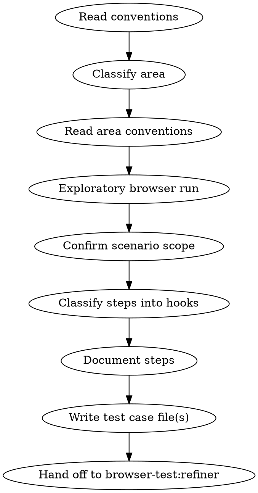

# E2E Test Author

## Overview

Transforms a vague user description (e.g., "test the purchase flow") into a structured, precise E2E test case by performing an exploratory browser run, then documenting each step with selectors, wait patterns, and verification points.

**Core principle:** Run first, document second. You cannot write a reliable test from reading code alone - you must observe the actual browser behavior.

## When to Use

- User describes a feature to test but doesn't provide precise steps
- A new feature needs its first E2E test
- User says "write a test for..." or "create a test case for..."

**Do NOT use when:**
- A structured test case already exists (use `browser-test:runner` instead)
- An existing test is flaky and needs stabilization (use `browser-test:refiner` instead)

## Prerequisites

- The Playwright MCP server must be available (configured in `.mcp.json`)
- Dev server must be running (or `E2E_BASE_URL` set to a reachable environment)
- Read `tests/e2e/conventions.md` and the relevant area conventions before starting
- When invoked with a Jira XRay key (e.g. `/author PROJ-247135`), the Atlassian Jira MCP server must be available to fetch test steps and acceptance criteria

## Process



**Hook-aware authoring :** Every test case the author produces MUST separate observations into three named markdown sections — `## Before Hook`, `## Test Steps`, `## After Hook`. The compiler maps these 1:1 to Playwright `test.beforeEach`, the `test()` body wrapped in `test.step()` blocks, and `registerTeardown` / `test.afterEach`. Inline setup or cleanup mixed into `## Test Steps` produces a malformed compiled spec.

### 1. Read conventions
Read `tests/e2e/conventions.md` (global) to understand session management, interaction patterns, wait strategies, and verification approach.

### 1b. Resolve Jira XRay source (when a key is provided)

When the user invokes `/author` with one or more Jira issue keys:

1. Call `getJiraIssue` via the Atlassian Jira MCP for **each** supplied key
2. Identify the XRay Test key: `issuetype` id `10006`. If none of the keys is an XRay Test, warn and continue from the user description only
3. Use the XRay Test issue **summary**, **description**, and any structured steps as the primary source of truth for scenario scope and expected results. Any non-XRay key (user story, epic, task) is used only as supplementary context — **never embedded in the output file**
4. Record only the XRay Test key — it **must** be written into the markdown file in Step 7 (see Jira metadata rules below)

If no Jira key is provided, proceed from the user's feature description only and omit Jira metadata from the output file.

### 2. Classify the functional area
Determine which area the test belongs to using the Functional Areas table in global conventions:

### 3. Read area conventions
Read `tests/e2e/{area}/conventions.md` for area-specific flows (e.g., Authentication login sequence, persona specific workflows).

**Catalog reusable procedures:** Before exploring, scan the area conventions for documented multi-step sequences (e.g., login flows, navigation patterns, dropdown interactions, admin panel access). Build a list of these — you will reference them by name in test steps rather than re-describing them. Also scan existing test cases in the area (`tests/e2e/{area}/*.md`) for repeated sub-flows that could be referenced.

### 4. Exploratory browser run
Using the Playwright MCP tools, explore the target area systematically. Start with a fresh browser session (follow Session Management from global conventions).

**Phase 1 — Reconnaissance:**
Navigate to the target area. Use `browser_snapshot` and `browser_take_screenshot` to observe page structure, available controls, visual layout, and initial state. Note the full set of interactive elements before touching anything.

**Phase 2 — Happy path exploration:**
Walk through the primary intended user flow end-to-end. For each step:
- Use `browser_snapshot` to inspect the accessibility tree before interacting
- Use `browser_click` (with accessibility ref from snapshot), `browser_type`, `browser_select_option` to interact
- Note expected behavior vs. actual behavior at each step
- **Record the element refs** that worked for each interaction
- Use `browser_take_screenshot` at key pages for reference

**Phase 3 — Edge case probing:**
After the happy path, probe boundary conditions:
- Empty states (no data, blank forms)
- Invalid inputs (wrong formats, out-of-range values)
- Rapid interactions (double-clicks, fast navigation)
- Error scenarios (missing required fields, unauthorized access)
- Note unexpected elements: banners, popups, redirects, pre-populated fields

**Phase 4 — State transition testing:**
Observe how the UI responds to state changes:
- Loading states and spinners
- Success/error feedback messages
- Data persistence after navigation (back button, page refresh)
- Conditional UI elements that appear/disappear based on state

**Phase 5 — Scenario identification:**
From your exploration, compile a list of distinct test-worthy scenarios. Each scenario should represent ONE verifiable user outcome (e.g., "successful purchase with single club", "error when email is invalid", "banner dismissal on return visit"). Prioritize user-critical paths over cosmetic details.

### 5. Confirm scenario scope
Present the identified scenarios to the user as a numbered list with one-sentence descriptions. Wait for confirmation before authoring. The user may narrow, expand, or reprioritize the list.

If only one scenario was identified (directed request like "test the login flow"), skip confirmation and proceed.

### 6. Document steps
For each approved scenario, convert the relevant exploratory run observations into structured steps:
- Each step has a clear action and optional verification
- Reference convention shorthand where applicable (e.g., "Complete login")
- Include conditional steps for elements that may or may not appear (banners, modals)
- Specify click-before-type for inputs prone to race conditions (especially number inputs)

**Classify every step into one of three hooks** (the compiler emits each one differently — getting the boundary wrong produces a malformed `.spec.ts`):

| Hook | What belongs here | What does NOT belong here |
|------|-------------------|---------------------------|
| **Before Hook** (Setup) | Login, env gates, captcha bypass, cookie injection, navigation to the starting state of the scenario, expanding/opening fixtures needed for every step. Must be deterministic on a clean session. | Anything the scenario is actually validating. If the test would still be meaningful with this step removed from coverage, it is setup — not a test step. |
| **Test Steps** (Scenario) | The actions and verifications under test. Each step represents a user-observable interaction or assertion that contributes to the pass condition. | Re-doing setup (re-login, re-navigating to the project). Cleanup. Restoring state. |
| **After Hook** (Teardown) | Idempotent cleanup that restores shared fixtures or removes resources the test created (delete project, restore row order, archive item, close extra tabs). Must be defensive — safe to run even if the test failed mid-way. | First-time creation of resources. Anything that mutates state the test depends on. Anything required for the test to start cleanly (that's Before Hook). |

**Rules for hook classification:**
- A step that ends with "**Verify:**" usually belongs in **Test Steps**. Verifications inside Before Hook are sanity checks for setup (e.g., "Verify the BOM tab is loaded") and should be terse.
- Anything captured during your exploration as "I had to do X to reach the starting state" is **Before Hook**.
- Anything captured as "I had to undo X so the next run starts clean" is **After Hook**.
- If a step both mutates state AND is the thing under test (e.g., "Create a new project" in a project-creation test), it stays in **Test Steps**, and you add a corresponding **After Hook** step to delete it.

### 7. Write the test case file(s)
For each scenario, create `tests/e2e/{area}/{test-name}.md` following this structure:

```markdown
# {Test Title}
<!-- Jira: PROJ-XXXXXX -->

## Summary
One-sentence description of what this test validates.

## Preconditions
- **Standard {area} preconditions** (see area conventions)
- {Only list test-specific preconditions here: specific project/data, fixture files, special permissions}
- **Environments:** local, preview {add staging/production only if applicable — see Test Safety}
- **Markers:** @regression @positive {plus area-specific tags}

## Before Hook

### Setup 1. {Setup title}
{Setup action — reference convention procedures by name}.
**Verify:** {Sanity check that setup landed at the expected starting state}

### Setup N. ...

## Test Steps

### 1. {Step title}
{Action description — reference convention procedures by name, not inline}.
**Verify:** {Expected outcome}

### N. Verify {final condition}
**Pass condition:** {What constitutes a passing test}

**Jira metadata rules:**

- When a Jira XRay key is known (from `/author PROJ-XXXXXX` or user input), include a comment on the line immediately after the heading: `<!-- Jira: PROJ-XXXXXX -->`
- When multiple keys are supplied (e.g. a user story and an XRay test), embed **only the XRay Test key** (`issuetype` id `10006`). User story, epic, and task keys are reference context only and must not appear in the file.
- When no Jira ticket exists yet, omit the `<!-- Jira: ... -->` line entirely. Do **not** use `jira: TBD` unless the user explicitly says the ticket is pending.
- Do **not** add `<!-- status: compiled | ... -->` — that is written by `/compiler` after Playwright generation.

## After Hook

### Teardown 1. {Teardown title}
{Idempotent cleanup action — must be safe to run even if the test failed mid-way}.

### Teardown N. ...
```

**If a section is empty for a given test, still include the heading with the body `_None — {one-line reason}._` so the compiler can confirm the section was considered (not forgotten).** Common reasons: read-only tests have no After Hook; tests using only standard area preconditions may have a minimal Before Hook referencing the convention.

**DRY rules for step authoring:**
- If a multi-step sequence is already documented in area conventions (login, navigation, dropdown interaction, admin access), reference it by convention section name — e.g., `Complete login (see area conventions: Authentication)`. Do NOT re-describe or inline the steps.
- If a code pattern exists in conventions (e.g., custom widget interactions, cookie injection, tree expansion), reference the convention and only specify the **varying parameters** (which element, which index, which option). Do NOT inline code blocks that duplicate convention patterns.
- If a sub-flow is shared with another test in the same area (e.g., "navigate to dashboard", "create a new record"), define it once in area conventions and reference it from both tests.
- Never hardcode URLs or subdomains — use the env var defined in area conventions (e.g., `E2E_BASE_URL`, `{AREA}_BASE_URL`). Verify step text says "navigate to `{ENV_VAR}`", not "navigate to `https://specific.domain.com`".

### 8. DRY validation checkpoint
Before handing off, review each authored test case against these checks:

1. **No inline login steps** — login must reference the convention procedure (e.g., "Complete login — see area conventions: Authentication"), not spell out SSO / credential / cookie steps.
2. **No duplicated preconditions** — common env vars, session setup, and auth requirements must reference `Standard {area} preconditions`, not list them individually.
3. **No hardcoded URLs** — all URLs must use env var names from conventions, never raw domains.
4. **No inline code blocks for convention patterns** — custom widget interactions, tree expansion, cookie injection, admin navigation, etc. must reference the convention section, not paste code.
5. **No duplicated sub-flows across tests** — if the same multi-step sequence appears in another test file in the area, it must be extracted to conventions and referenced from both.
6. **Convention gaps filled** — any new reusable pattern discovered during authoring must be added to area conventions, not left inline.
7. **Three hook sections present** — `## Before Hook`, `## Test Steps`, and `## After Hook` headings all exist. Empty sections use the `_None — {reason}._` placeholder. A test case missing any of the three sections is malformed.
8. **No setup leakage into Test Steps** — login, navigation to the starting state, fixture expansion, and tab opening are in Before Hook, never in `## Test Steps`. Likewise no `## Test Steps` action exists solely to "reset" state — those belong in After Hook.
9. **After Hook is idempotent and defensive** — each Teardown step is written as "If X exists, remove/restore it" rather than "Delete X". The compiler emits a visibility guard, so the markdown must allow it.
10. **Pass condition lives in Test Steps** — the final `## Test Steps` step (or its `**Pass condition:**` line) defines what passing means. After Hook never contains assertions about the scenario's outcome.

If any check fails, fix the test case before proceeding. If a convention update is needed, make it first.

### 9. Hand off to refiner
Tell the user the test case(s) are ready for refinement. List each authored file:

```
Authored test cases:
- tests/e2e/{area}/{test-1}.md — {one-sentence summary}
- tests/e2e/{area}/{test-2}.md — {one-sentence summary}

Next step: invoke `browser-test:refiner` on each test case to stabilize it.
After refinement: invoke `browser-test:compiler` to generate Playwright .spec.ts files.
```

## Guidelines

- **Download actions:** When a step involves clicking a "Download" icon or button, note the expected file (name or type) in the step. Do not describe interacting with the browser's native download bar — it is not accessible from Playwright automation. The compiler will translate the click into a `page.waitForEvent('download')` pattern and verify the file via `download.path()` or `download.saveAs()`.
- **Accessibility-tree first:** Use `browser_snapshot` refs for all UI interactions (`browser_click`, `browser_type`, `browser_select_option`). Do not use `browser_evaluate` with `document.querySelector` or CSS selectors to interact with UI elements. Reserve `browser_evaluate`/`browser_run_code` for non-UI operations (clearing cookies/storage) or when the accessibility tree genuinely can't express what you need (visual state checks, third-party widgets without ARIA).
- **Direct fill for inputs with floating labels:** Use `browser_type` directly on input refs — Playwright's `fill()` sets the value programmatically without pointer events, bypassing floating label overlays. No need for JS focus workarounds.
- **Terse but precise:** Steps should be natural language, as short as possible without losing critical information
- **Reference conventions:** Don't repeat Auth0 login steps inline - say "Complete Auth0 login"
- **Conditional steps:** Use "if present" for elements that may not always appear
- **Verification at boundaries:** Add `**Verify:**` after page transitions, not after every click
- **Pass condition:** The final step must define what "pass" means unambiguously
- **Use .env references:** Never hardcode credentials - reference `TEST_USER_1_EMAIL` etc.
- **Use `E2E_BASE_URL`:** Never hardcode URLs - use the env var in navigation steps
- **Environments line:** Always include an `**Environments:**` line in preconditions. Default to `local, preview`. Only add `production` if the test is strictly read-only (no form submissions, no checkouts, no data mutations). See global conventions: Test Safety.
- **Markers line:** Always include a `**Markers:**` line in preconditions listing the Playwright tags the compiler should emit (e.g., `@regression @positive @bom`). At minimum: one phase tag (`@smoke`/`@regression`/`@sanity`), one polarity tag (`@positive`/`@negative`), and one area tag.
- **Hook discipline:** Before Hook is for setup, After Hook is for restoring/cleaning state, Test Steps is for the scenario under test. Anything that re-runs setup mid-test, or restores state inside a `## Test Steps` block, is a classification bug.

### DRY Principles

- **Convention-first authoring:** Before writing any step, check if the action sequence is already documented in area conventions. If it is, reference the convention section name and only specify parameters that vary. Never duplicate convention content in test steps.
- **Shared preconditions:** Each area should define standard preconditions in its conventions (environment, session, credentials, cookie injection). Test files reference these with `**Standard {area} preconditions** (see area conventions)` and only list test-specific additions.
- **Extract repeated sub-flows:** If you discover during authoring that two or more tests in the same area share a multi-step sequence (e.g., "navigate to dashboard", "open a form and submit a record"), add that sequence as a named procedure in the area conventions file, then reference it from each test. Do not let the same steps exist in multiple test files.
- **Parameterize, don't duplicate:** When sub-flows differ only in data (record name, category, status value), define the procedure once with `{parameter}` placeholders in conventions and pass the values from each test.
- **No inline code blocks for convention patterns:** If a code pattern (custom widget interaction, tree expansion, cookie injection) is documented in conventions, do NOT paste the code into the test step. Reference the convention and specify only what varies (e.g., "Open the custom dropdown at index 0, select `option 'Category A'` — see area conventions: Custom Dropdowns").
- **Update conventions when authoring reveals gaps:** If the exploratory run uncovers a reusable pattern not yet in conventions, add it to conventions first, then reference it from the test. This keeps conventions as the single source of truth.