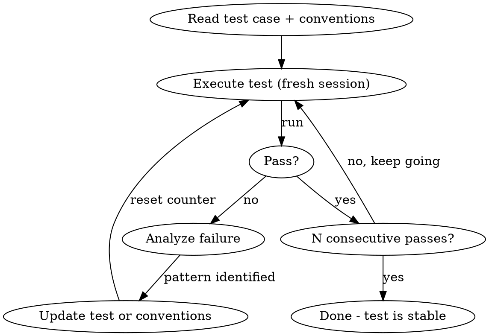

# E2E Test Refiner

## Overview

Takes a structured test case and makes it deterministic by running it repeatedly, identifying failure patterns, and refining both the test case and shared conventions. Stops when N consecutive runs pass without the runner deviating from the documented steps.

**Core principle:** A test isn't done until it passes N times in a row with identical execution. Every workaround discovered belongs in the test case or conventions, not in the runner's head.

## When to Use

- A new test case was just authored (handoff from `browser-test:author`)
- An existing test is flaky or inconsistent
- User says "stabilize this test" or "make this test reliable"

**Do NOT use when:**

- No structured test case exists yet (use `browser-test:author` first)
- A stable test just needs to be executed (use `browser-test:runner`)

## Prerequisites

- Structured test case file exists in `tests/e2e/{area}/`
- The Playwright MCP server must be available (configured in `.mcp.json`)
- Dev server must be running (or `E2E_BASE_URL` set to a reachable environment)

## Process

### 1. Read the test case and conventions

Read the test case file, global conventions, and area conventions. Understand every step before running.

Check the test's **Environments** line against `E2E_ENVIRONMENT` (default: `local`). If the current environment is not listed, refuse to execute. Use `E2E_BASE_URL` (default: `http://localhost:5173`) wherever the test references it.

**Validate the three-hook structure .** The test case MUST contain three top-level sections: `## Before Hook`, `## Test Steps`, `## After Hook`. If any section is missing, stop and report — this is a hand-off bug from the author skill, not a refinement issue. Empty sections are allowed only when the markdown uses the explicit `_None — {reason}._` placeholder body. Fixing missing sections is an author-skill responsibility, not a refiner-skill responsibility.

### 2. Execute with fresh session

Follow the Session Management procedure from global conventions:

1. Close any existing browser session (`browser_close`)
2. Navigate to `E2E_BASE_URL` - this starts a fresh browser instance
3. Verify clean session (cookie consent banner should appear on first navigation)

### 3. Execute the test

Follow the test case steps in hook order: `## Before Hook` → `## Test Steps` → `## After Hook`. Do not improvise or add steps not in the document. If you must deviate, that's a signal the test case needs updating.

**After Hook is mandatory and runs even if Test Steps fails.** Treat the execution as a try/finally: if any Test Step fails, capture the failure evidence, then still run every step in `## After Hook` so the next refinement run starts from a clean state. Record any After Hook failures separately (a teardown failure does not mask a test step failure).

### 4. On failure: analyze and update

When a step fails:

1. **Screenshot** the current state
2. **Note which hook failed** — Before Hook, Test Steps, or After Hook. Failures in different hooks have different fix patterns:
   - **Before Hook failure** → setup is non-deterministic or convention drift. Fix the setup step or the referenced convention.
   - **Test Steps failure** → standard refinement (timing, selector, missing wait).
   - **After Hook failure** → cleanup is not defensive enough. Add a visibility guard or re-read state before mutating.
3. **Identify the root cause** - is it a timing issue, missing wait, unexpected element, stale selector?
4. **Classify the fix:**
   - **Hook misclassification:** A step is in the wrong section (setup leaked into Test Steps, or a Test Step is restoring state and should be in After Hook). Move it to the correct section in the markdown.
   - **Test-specific:** Update the test case file (e.g., add a conditional step for a banner)
   - **Area-wide pattern:** Update the area conventions (e.g., document a common popup across all purchase tests)
   - **Global pattern:** Update global conventions (e.g., a new wait strategy)
5. **Apply the fix** to the appropriate file
6. **Reset the consecutive pass counter** to 0

### 5. On pass: increment counter

When the test passes, increment the consecutive pass counter. Continue running until reaching N consecutive passes (default: 5).

### 6. Report results

When done, report:

- Total runs attempted
- Files modified (test case and/or conventions)
- Patterns discovered and where they were documented
- Final N consecutive pass confirmation

## Common Refinement Patterns

| Symptom | Likely Fix | Where to Document |
|---------|-----------|-------------------|
| Click does nothing | Add `await_element` before click | Global conventions (Interaction Patterns) |
| Input gets wrong value | Add click-to-focus before type | Global conventions (Interaction Patterns) |
| Element obscured by overlay | Add conditional dismiss step | Area conventions or test case |
| Redirect loses context | Use time-based wait + snapshot check | Global conventions (Wait Patterns) |
| Stale selector after navigation | Wait for landmark on target page | Test case step |
| Pre-populated data unexpected | Document in test preconditions | Test case preconditions |
| Step times out at 15s/30s/60s+ | Switch to `smartWaitFor(locator)` from `playwright-tests/utils/timeouts.ts` — retry-aware cap (2/3/4 min for attempt 0/1/2+) with `networkidle` fail-fast. Use `{ timeout: currentTimeout() }` for native Playwright assertions. | Compiled spec; do NOT add a new fixed timeout. |
| Lazy/virtualised section never visible | Use `smartScrollIntoView(locator)` (re-issues scroll until target paints). | Compiled spec. |
| Whole test exceeds `test.setTimeout` because one wait consumed the budget | Bump `test.setTimeout` to at least `360000` (≥1.5× retry-2 cap). Never set the test budget equal to or below `currentTimeout()`. | Compiled spec. |

## Rules

- **Never work around a problem silently.** Every deviation from the written steps must be captured as a test case or conventions update.
- **Reset counter on any change.** If you modify the test case or conventions, the N consecutive passes must restart from 0.
- **Fresh session every run.** No exceptions. Session bleed between runs is the #1 source of false passes.
- **Default N = 5.** User can override this. For critical flows, suggest N = 10.
- **Three-hook structure is load-bearing .** The author skill produces tests with `## Before Hook` / `## Test Steps` / `## After Hook` sections; the compiler relies on those boundaries to emit `test.beforeEach` / `test.step` / `registerTeardown`. If refinement uncovers a step in the wrong section, treat that as a legitimate fix and move it — don't accept a misclassified test as stable.
- **After Hook always runs.** The refiner executes Before → Test Steps → After Hook with try/finally semantics. A test isn't stable if its After Hook is fragile, even if Test Steps pass consistently — record After Hook failures and refine the cleanup steps.
